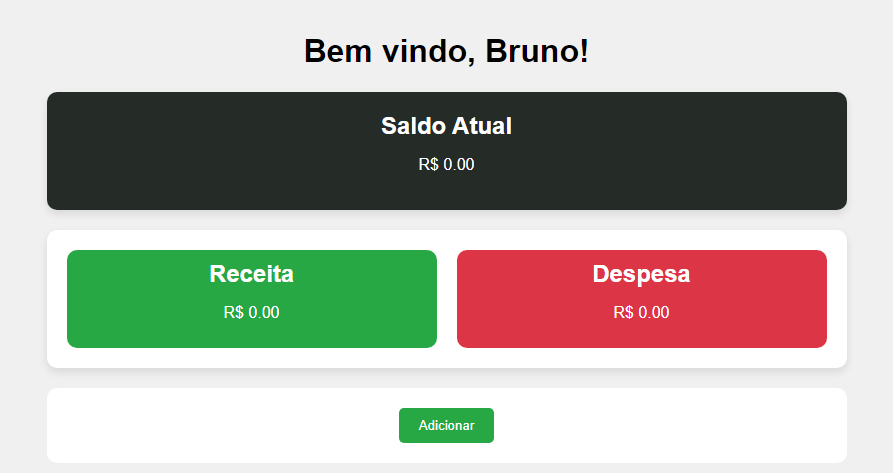

# Finança Total
Este é um projeto feito para a disciplina de "Programação para dispositivos móveis". 

O projeto consiste em um PWA (Progressive Web Application) com a temática voltada ao controle de finanças.

Para mais testes: [Projeto Hospedado no GITHUB pages](https://brun0henr1que.github.io/projeto_financeiro_2/)

## Funcionalidades

- Gravação de receita/despesa com detalhamento, data e hora.
- Uso da câmera do smartphone ou webcam para ler valores de QRcodes.
- Notificação push.
- Geração de gráficos de balanço entre receita e despesa.
- Geração de histórico detalhado para registro das informações inseridas.

## Demonstração

#### Tela Inicial

#### Primeiro contato

#### Tela de edição de receita/despesa

#### Geração de gráficos

#### Histórico
 
